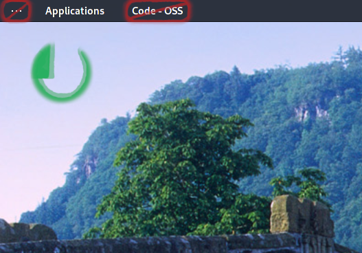

[](https://www.buymeacoffee.com/ente)  [](https://www.paypal.com/donate?hosted_button_id=CRGNTJBS4AD4G)

# kitsch

Kitsch is a collection of cheap, popular, and marketable improvements to Gnome. One could consider it applying a cosmetic surgery to Gnome.

- remove activities
- remove application menu
- change the wallpaper in a configurable interval using local pictures

This extension does not come with any button on the panel.



## Configuration

If no configuration is found, a default config is restored at `~/.config/kitsch.json`. Whenever the configuration file changes, the extension reloads automatically.

The configuration has three segments: `settings` and `hideFromPanel` and `wallpaper`.

### Example

```JSON
{
  "settings": {
    "loglevel": "debug"
  },
  "hideFromPanel": {
    "activities": true,
    "appMenu": true
  },
  "wallpaper": {
    "interval": 600,
    "recursive": true,
    "shuffle": true,
    "paths": [
      "~/Pictures"
    ],
    "mimetypes": [
      "image/jpeg",
      "image/png"
    ]
  }
}
```

### Settings

- `loglevel`: (string) the log level of the extenions. any of the following values is valid:
  - `debug`
  - `info`
  - `warning` (default)
  - `error`

### hideFromPanel

- activities: (boolean) hide the activities button on the left of the top bar
- appMenu: (boolean) hide the application menu on the top bar
- *: (boolean) one can add any item that refers to a direct child of imports.ui.main.panel.statusArea

## License

Guillotine: a gnome extension designed for efficiently carrying out executions of commands from a customizable menu
Copyright (C) 2021 Christian Klaue [mail@ck76.de]

This program is free software: you can redistribute it and/or modify
it under the terms of the GNU Affero General Public License as published by
the Free Software Foundation, either version 3 of the License, or
(at your option) any later version.

This program is distributed in the hope that it will be useful,
but WITHOUT ANY WARRANTY; without even the implied warranty of
MERCHANTABILITY or FITNESS FOR A PARTICULAR PURPOSE.  See the
GNU Affero General Public License for more details.

You should have received a copy of the GNU Affero General Public License
along with this program.  If not, see <https://www.gnu.org/licenses/>.

Individual licenses may be granted upon request.